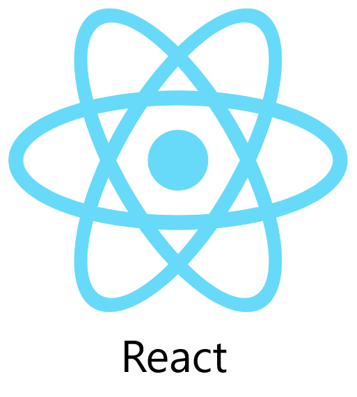

# Core Icons Library

Uma biblioteca profissional de ícones para linguagens, frameworks e ferramentas de desenvolvimento.


**Versão:** 1.0.0 | **Proprietário:** Maurício Spark | **Marca:** SPARK

---

## O que é

Core Icons Library é um catálogo público de ícones técnicos com **370+ ícones** para stacks dev. Inclui interface 3D, pesquisa em tempo real, visualização em grade/lista e uma API JavaScript para integração em projetos.

**Acesse:** `https://mauriciospark.github.io/coreIcons`

---

## Estrutura do Projeto

```
coreIcons/
├── index.html          # Página principal do catálogo
├── css/
│   └── style.css       # Estilos e animações 3D
├── javascript/
│   ├── data.js         # Dados dos 370+ ícones
│   ├── core-icons.js   # API JavaScript
│   └── script.js       # Lógica da interface
├── fotos/         # Ícones PNG (370+ arquivos)
├── favicon/            # Favicons e manifest
└── docs/               # Documentação detalhada
    ├── README.md
    ├── API.md
    ├── USAGE.md
    └── ...
```

| Arquivo/Pasta | Função |
|--------------|--------|
| `index.html` | Página principal com catálogo interativo |
| `css/style.css` | Tema escuro, animações 3D, responsividade |
| `javascript/data.js` | Lista de todos os ícones disponíveis |
| `javascript/core-icons.js` | API para usar os ícones programaticamente |
| `javascript/script.js` | Busca, filtros, modal, efeitos 3D |
| `fotos/` | Pasta com todos os arquivos PNG |
| `docs/` | Documentação completa |

---

## Funcionalidades

- **370+ ícones** — linguagens, frameworks, ferramentas, CI/CD, cloud
- **Interface 3D** — cards com perspectiva e inclinação ao passar o mouse
- **Pesquisa em tempo real** — busca por nome, slug ou arquivo
- **Dupla visualização** — modo grade ou lista
- **Modal de detalhes** — URL pública e nome do ícone para copiar
- **Atalhos de teclado** — Ctrl+K (busca), Shift+Click (copiar HTML), Escape (fechar)
- **100% responsivo** — mobile, tablet e desktop
- **API JavaScript** — integre em qualquer projeto

---

## Uso Rápido

### 1. Catálogo Online

Acesse o catálogo e clique em qualquer ícone para copiar sua URL.

### 2. Em HTML

```html

```

### 3. Com a API JavaScript

```html
<script src="javascript/data.js"></script>
<script src="javascript/core-icons.js"></script>
<script>
  // Lista todos os ícones
  const icons = CoreIcons.getAll();
  
  // Busca por slug
  const react = CoreIcons.getBySlug('react');
  
  // Pesquisa
  const results = CoreIcons.search('java');
  
  // Gera HTML de imagem
  const html = CoreIcons.imgHtml('react', { width: 48, height: 48 });
  // Resultado: 
</script>
```

---

## API JavaScript

Todos os métodos disponíveis em `CoreIcons`:

| Método | Descrição | Exemplo |
|--------|-----------|---------|
| `getAll()` | Retorna todos os ícones | `CoreIcons.getAll()` |
| `getBySlug(slug)` | Busca um ícone pelo identificador | `CoreIcons.getBySlug('react')` |
| `search(query)` | Pesquisa ícones por termo | `CoreIcons.search('node')` |
| `urlFor(icon)` | Gera URL do ícone | `CoreIcons.urlFor('vue')` |
| `imgHtml(icon, attrs)` | Gera tag HTML `` | `CoreIcons.imgHtml('angular', {width: 32})` |
| `setBasePath(path)` | Define caminho base | `CoreIcons.setBasePath('icons/')` |

### Exemplo Completo

```javascript
// Renderizar grid de ícones
const container = document.getElementById('icons');

CoreIcons.getAll().forEach(icon => {
  const div = document.createElement('div');
  div.innerHTML = `
    ${CoreIcons.imgHtml(icon, { width: 32, height: 32 })}
    <span>${icon.name}</span>
  `;
  container.appendChild(div);
});

// Busca com autocomplete
const search = document.getElementById('search');
search.addEventListener('input', (e) => {
  const results = CoreIcons.search(e.target.value);
  console.log(results); // Ícones encontrados
});
```

---

## Hospedagem Própria

1. Faça download ou clone o repositório
2. Hospede em qualquer servidor estático:
   - **GitHub Pages** — Configurar em Settings > Pages
   - **Netlify** — Drag and drop ou conecte o Git
   - **Vercel** — Importe o repositório
   - **Surge.sh** — `surge .`
   - **Qualquer servidor** — Apache, Nginx, etc.

### URL Customizada

Configure o caminho base no seu site:

```javascript
// Antes de carregar os scripts
window.CORE_ICONS_PUBLIC_BASE = 'https://seu-dominio.com/coreIcons';
```

---

## Ícones Disponíveis

### Linguagens
Assembly, C, C++, C#, D, Dart, Delphi, Elixir, Erlang, Fortran, Go, Haskell, Java, JavaScript, Julia, Kotlin, Lisp, Lua, MATLAB, Perl, PHP, Python, R, Ruby, Rust, Scala, Swift, TypeScript, Zig...

### Frameworks Frontend
Angular, Astro, Ember, Gatsby, Gridsome, Next.js, Nuxt.js, React, Remix, Svelte, Vue.js...

### Backend & Mobile
Adonis, Django, Express, Fastify, Flutter, Ionic, Laravel, NestJS, Node.js, Rails, React Native, Spring...

### DevOps & Cloud
Ansible, AWS, Azure, CircleCI, Docker, Firebase, GitHub Actions, GCP, Heroku, Jenkins, Kubernetes, Netlify, Travis CI, Vercel...

### Ferramentas
Babel, ESLint, Git, Gulp, Jest, MongoDB, npm, PostgreSQL, Prettier, Redis, Vite, Webpack, Yarn...

**Total:** 370+ ícones. Veja a lista completa em `docs/fotos-list.txt` (atualizar para `Documentos-list.txt` se renomear).

---

## Documentação Detalhada

Para informações mais específicas, consulte os arquivos na pasta `docs/`:

| Documento | Conteúdo |
|-----------|----------|
| `docs/API.md` | Referência completa da API JavaScript |
| `docs/USAGE.md` | Guia de uso em HTML, Markdown, CSS, React, Vue |
| `docs/CONTRIBUTING.md` | Como contribuir com novos ícones |
| `docs/CHANGELOG.md` | Histórico de versões |
| `docs/STRUCTURE.md` | Arquitetura técnica do projeto |
| `docs/fotos-list.txt` | Lista completa de todos os ícones |

---

## Atalhos de Teclado

| Atalho | Ação |
|--------|------|
| `Ctrl + K` | Focar campo de busca |
| `Shift + Click` | Copiar HTML do ícone |
| `Enter` / `Space` | Abrir ícone selecionado |
| `Escape` | Fechar modal |

---

## Tecnologias

- HTML5 semântico
- CSS3 (Grid, Flexbox, variáveis, animações 3D)
- JavaScript ES5+ (compatível IE11+)
- Google Fonts (Plus Jakarta Sans)

---

## Licença

© 2026 Maurício Spark. Todos os direitos reservados.

**Marca:** SPARK | **Linhagem:** SPARK | **Projeto:** Core Icons Library

---

**Core Icons Library** — ícones para stacks, CI/CD e documentação técnica
