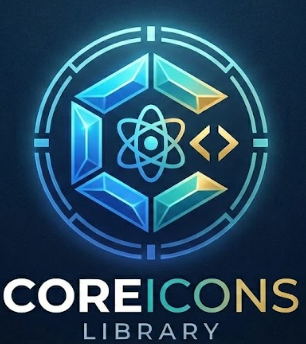
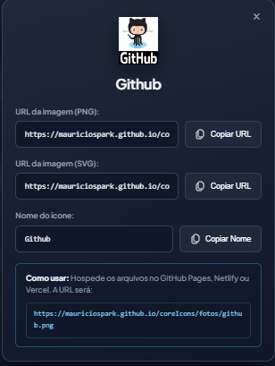
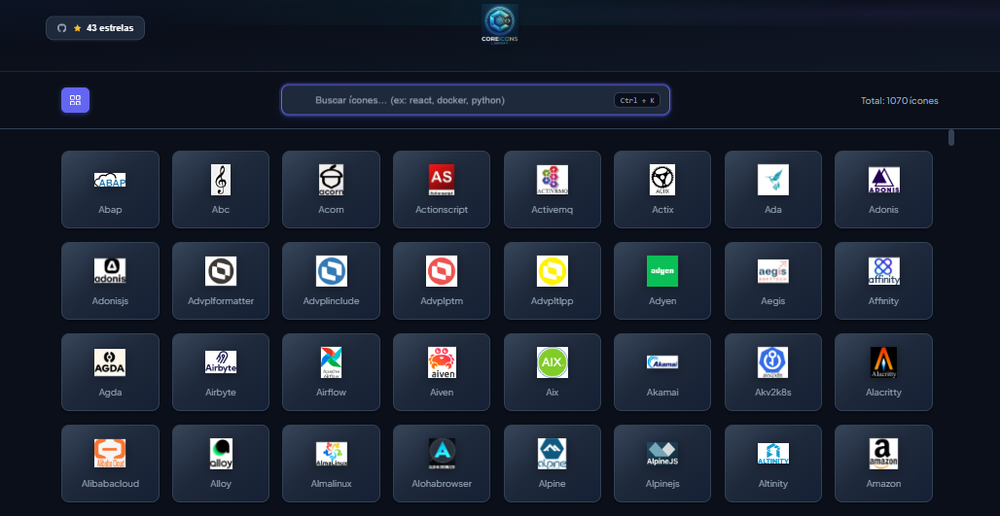

# CoreIcons Library

Uma biblioteca profissional de ícones para linguagens, frameworks e ferramentas de desenvolvimento.





## Sobre

**CoreIcons Library** é um catálogo público de ícones técnicos para stacks e ferramentas dev. Inclui recursos de pesquisa, pré-visualização 3D e URLs para uso em documentação e projetos.

- **Versão:** 1.1.0
- **Proprietário:** Maurício Spark
- **Marca:** Spark
- **Linhagem:** SPARK

## Características

- **1067 ícones** para linguagens, frameworks e ferramentas
- **Interface 3D** com efeitos de perspectiva e inclinação
- **Pesquisa em tempo real** com filtros inteligentes
- **Visualização em grade ou lista**
- **URLs públicas** para uso em documentação
- **API JavaScript** para integração em projetos
- **Suporte a atalhos de teclado** (Ctrl+K para pesquisa)
- **Botão de estrelas do GitHub** com contagem em tempo real

## Estrutura do Projeto

```
coreIcons/
├── index.html          # Página principal
├── css/                # Estilos e animações 3D
│   └── style.css
├── javascript/         # Scripts da aplicação
│   ├── data.js         # Dados dos ícones
│   ├── core-icons.js   # API JavaScript
│   └── script.js       # Lógica da interface
├── docs/               # Documentação
├── fotos/              # Arquivos de ícones PNG (1002+ ícones)
├── favicon/            # Favicons e manifest
└── LICENSE             # Licença
```

## Documentação

- [API Reference](docs/API.md) - Documentação completa da API JavaScript
- [Guia de Uso](docs/USAGE.md) - Como usar os ícones em seus projetos
- [Contribuição](docs/CONTRIBUTING.md) - Diretrizes para contribuidores
- [Changelog](docs/CHANGELOG.md) - Histórico de versões
- [Estrutura](docs/STRUCTURE.md) - Arquitetura do projeto

## Uso Rápido

### Catálogo Online

Acesse o catálogo em: `https://mauriciospark.github.io/coreIcons`

### API JavaScript

## Licença

© 2026 Maurício Spark. Todos os direitos reservados.

---

**CoreIcons Library** · ícones para stacks, CI/CD e documentação técnica
